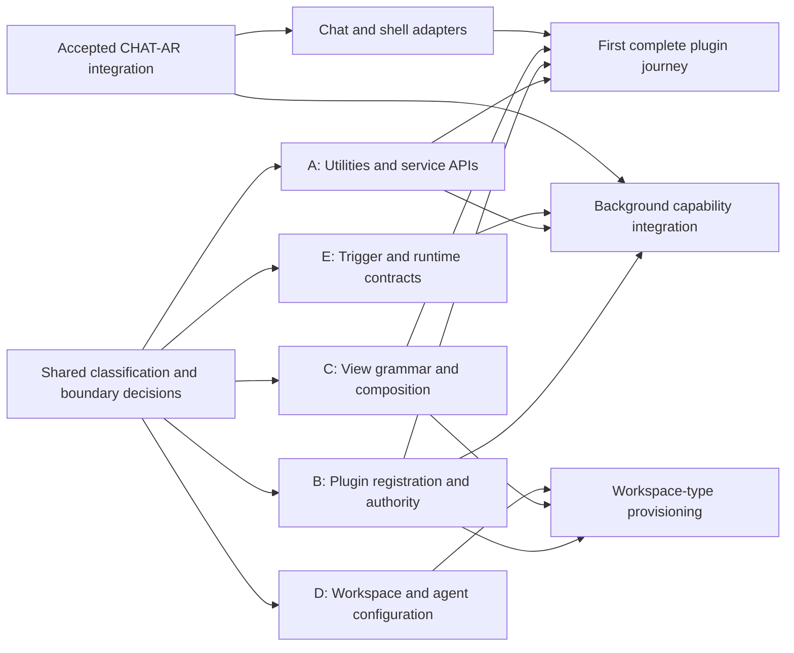

# Parallel Roadmaps — Candidate Shape

**Capture:** cross-roadmap integration concept · **Parent:** [Plugin System](../030-Plugin_System/plugin-system-vision.md)
**Status:** assistant proposal for discussion; no executable roadmap or SPEC authorization
**Updated:** 2026-09-22 (PDT)
**Trickle-down:** owner direction and accepted contracts · **Roll-up:** track boundaries and integration decisions

## Organizing principle

**Historical proposal:** The owner subsequently defined Mission Control as coordinating three roadmaps, not authoring them. These five candidate tracks remain unadopted background; they do not identify the three roadmaps. See [mission-control.md](mission-control.md).

Parallelism comes from stable interfaces and separate ownership. Several agents editing different parts of the same chat manager, shell or permission model would still be coupled work. Define what each roadmap produces and what others may rely on, then let each roadmap order its own SPECs.

Treat CHAT-AR as an existing prerequisite program with its own supervisor and owner gates. Plugin planning neither restarts it nor changes its sequence. A future cross-roadmap coordinator should track shared contracts, dependencies and integration outcomes; each roadmap supervisor remains responsible for its own SPEC chain. This coordination arrangement is proposed, not created by this capture.

## Candidate roadmap tracks

These are outcome families that could later become multiple SPECs. Names and boundaries are provisional.

| Track | Outcome and possible SPEC progression | Principal dependencies and overlap limits |
|---|---|---|
| A — Shared utilities and service boundaries | Inventory reusable capabilities → extract a small pure utility set → expose one non-chat capability through a narrow API → integration proof | Select concrete consumers first; avoid a speculative utility library. No thread/runtime extraction while CHAT-AR owns that work. Privileged service adapters depend on B's grant contract. |
| B — Plugin registration and authority | Classification/package contract → management surface and registry → consent/verification/revocation → lifecycle and service enforcement | Owns manifest/grant meaning. UI adapters touching shell/panels need an integration gate. Consent storage, hash coverage and rescan behavior must be explicit. Provenance publication is a separate dependency. |
| C — Composable views and instances | Composition grammar/validation → reusable view host and bindings → definition/instance lifecycle → first existing or new view | Design against B's contribution contract and A's APIs. Chat embedding consumes accepted CHAT-AR presentation/action owners. No second chat store, runtime or per-mount global action consumer. |
| D — Workspace types and agent configuration | Scope/install-unit rules → deterministic resolution and validation → spawn-time assembly → workspace-type provisioning | Shares package vocabulary with B and instance bindings with C. Harness activation/cwd/environment changes wait for explicit agreement with accepted chat service owners. Scope is availability, not accidental override authority. |
| E — Background execution and integrations | Trigger/run contract → bounded execution → one connector or watched root → managed runtime lifecycle | Depends on B and selected A APIs; chat activation/Stop consumes the final chat lifecycle seam. Canonical event publication waits on the applicable provenance contract. Local models and broad connector catalogs are later candidates. |

Cross-cutting obligations belong to every track: explicit identity, upgrade/disable behavior, data ownership, failure results, isolated test resources, and evidence that consumers use the shared contract. Canonical event/provenance integration has an identified producer boundary, not raw plugin access to the bus.

## Dependency waves

The graph describes deliverable dependencies, not a requirement to finish an entire track before any consumer can begin. A versioned, tested contract can release a bounded consumer SPEC. Final chat integration gates chat-dependent adapters; it does not block all pure utilities, plugin-local validation or design.

**Wave 0 — current conversation:** settle the product boundaries and first proof; reconcile source conflicts; map the shared contracts and code ownership. Multiple bounded research assignments can run now without changing product code.

**Wave 1 — after roadmap approval:** run independent foundation SPECs against agreed contract versions in separate worktrees. Registry/enforcement, pure utilities, view grammar and scope-resolution work can overlap where their write sets and behavior dependencies are independent. Mock implementations can support contract development, but do not count as end-to-end integration evidence.

**Wave 2 — first integration:** combine the minimum A/B/C work and accepted chat adapters for the chosen complete journey. Add D if workspace provisioning is part of that milestone. Exercise enable, disable, mismatch, denial, duplicate/recovery and exact-target behavior before expansion.

**Wave 3 — expansion:** migrate additional views and add background execution/connectors/managed runtimes from the proven interfaces. Avoid making all of these prerequisites for the first useful result.

## Shared contracts to agree before independent implementations

| Contract | Proposed primary owner | What must be unambiguous |
|---|---|---|
| Package and contribution | B | IDs, versioning, declaration schema, content versus executable/config bytes, install/update unit, storage roots |
| Capability and command | B with each service owner | Requested/granted powers, invocation identity, denial, revocation and verification at use; narrow inputs/results |
| View instance and binding | C | Plugin definition reference, instance-owned content/state, portable descriptor validation, unavailable-state behavior |
| Chat action and lifecycle | Existing CHAT-AR owners | Workspace/view/group/session identity; exact target and truthful result; one acceptance/receipt/runtime authority |
| Workspace and spawn configuration | D with chat lifecycle owner | Scope collisions, resolution, immutable activation snapshot, cwd/environment policy, changes to existing sessions |
| Trigger/run and evidence | E with provenance owner | Run identity, cancellation/retry/recovery, budgets, producer registration, local records versus canonical publication |

## Proposed coordination rules

- Each future SPEC declares input contract versions, output contracts, owned paths, shared integration paths, and tests of consumer behavior.
- Separate worktrees isolate edits. They do not remove behavioral dependencies or automatically include accepted uncommitted chat work. Establish an owner-approved integration commit before deriving executable bases; do not assume current main or HEAD contains that work.
- Keep one owner for each shared API/schema. Contract changes record affected downstream SPECs and require targeted reconciliation before those consumers continue.
- Serialize migrations, common registries, shell/panel integration and common fixture changes through named integration ownership. Reserve migration numbers against the actual integrated head; the observed development migration head is 045, not the archive's 043.
- Run independent SPECs concurrently only after their dependencies and write scopes are proven independent. Preserve each roadmap's owner acceptance gates; a green parallel branch is not acceptance of the combined release.
- Integration checkpoints verify a real user journey and failure behavior. The parent coordinator reports what merged, which contract changed, which checks passed and which consumers remain blocked.

## Readiness for detailed roadmaps

Proceed to roadmap/SPEC drafting when the first outcome and first-party boundary are clear enough to define deliverables, each track has a non-overlapping owner, shared interfaces have a concrete agreement, and active CHAT-AR/provenance dependencies are explicitly mapped. This capture does not yet satisfy or claim those approvals.
